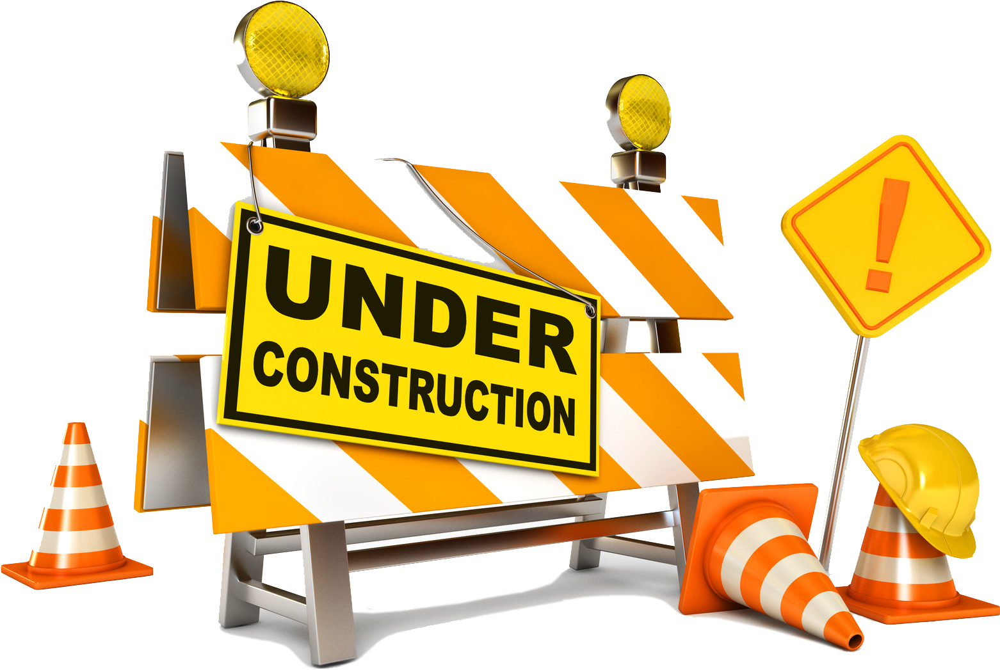

{:class="shim"}

{:data-bg="/assets/img/fire.jpg" class="dark half-height"}
# Learning to Burn

> Your free Learning to Burn resource just perfect for NZ

> Just sign in to get started!

### The perfect content

The lessons are crafted especially for NZ conditions and people by scientists at [Scion NZ  ](https://scionresearch.com)

{:class="sample"}

### Keep a track of your learning

{:class="sample"}

As you work through your learning, you can keep a track of how much you've learned.

### Learn at your own pace

There's no monthly fee or time-based restrictions - just use the site whenever it suits you.

{:class="sampleright"}
We can even generate a simple learning schedule to add to your calendar!

